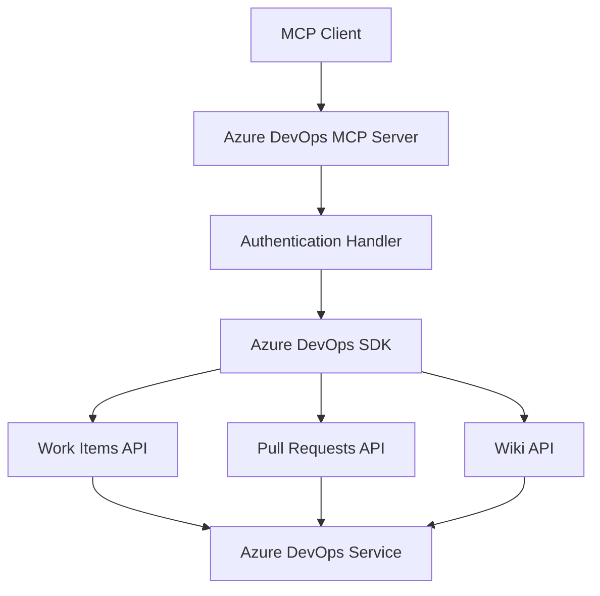

# System Patterns

## Architecture Overview



## Component Design

### 1. Authentication Handler

* Manages PAT token validation
* Handles token refresh if needed
* Provides authenticated SDK instance

### 2. Work Items Module

* List work items with filtering
* Get detailed work item info
* Create new work items with validation

### 3. Pull Requests Module

* List PRs with status filtering
* Get PR details with comments
* Create new PRs with validation

### 4. Wiki Module

* Create new pages
* Edit existing content
* Handle markdown conversion

## Tool Definitions

### Work Items

```typescript
interface WorkItemTools {
  listWorkItems: {
    input: {
      project: string;
      types?: string[];
      states?: string[];
      assignedTo?: string;
    };
    output: WorkItem[];
  };
  getWorkItem: {
    input: {
      id: number;
      project: string;
    };
    output: WorkItemDetail;
  };
  createWorkItem: {
    input: {
      project: string;
      type: string;
      title: string;
      description?: string;
      assignedTo?: string;
    };
    output: WorkItem;
  };
}
```

### Pull Requests

```typescript
interface PullRequestTools {
  listPullRequests: {
    input: {
      project: string;
      repository: string;
      status?: 'active' | 'completed' | 'abandoned';
    };
    output: PullRequest[];
  };
  getPullRequest: {
    input: {
      project: string;
      repository: string;
      pullRequestId: number;
    };
    output: PullRequestDetail;
  };
  createPullRequest: {
    input: {
      project: string;
      repository: string;
      title: string;
      description: string;
      sourceBranch: string;
      targetBranch: string;
      reviewers?: string[];
    };
    output: PullRequest;
  };
}
```

### Wiki

```typescript
interface WikiTools {
  createWikiPage: {
    input: {
      project: string;
      wiki: string;
      path: string;
      content: string;
    };
    output: WikiPage;
  };
  editWikiPage: {
    input: {
      project: string;
      wiki: string;
      path: string;
      content: string;
      etag: string;
    };
    output: WikiPage;
  };
}
```

## Error Handling

1. API Errors
* Rate limiting
* Authentication failures
* Resource not found
* Permission denied

2. Validation Errors
* Invalid input parameters
* Missing required fields
* Format validation

3. Network Errors
* Connection timeouts
* Service unavailable
* DNS resolution failures

## Logging Strategy

```typescript
// Comprehensive logging pattern
logger.info('[Setup] Initializing Azure DevOps client'); 
logger.debug('[API] Request:', { method, url, params }); 
logger.error('[Error] Operation failed:', { 
  error, 
  context: {

    operation,
    inputs,
    timestamp

  }
}); 
